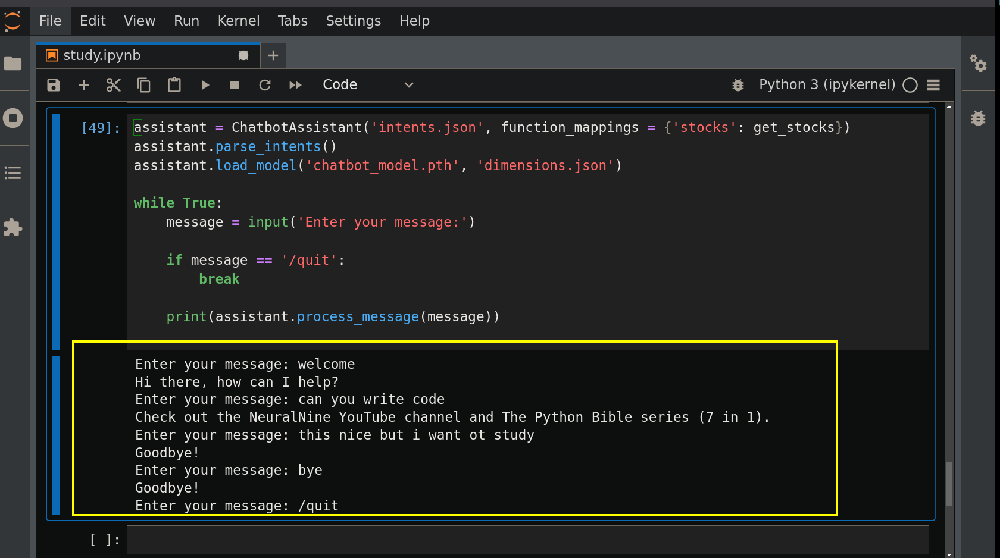

# Chatbot Implementation in Python with PyTorch


## Dependencies

The code relies on the following Python libraries:

- `os`: For interacting with the operating system, such as checking if a file exists.
- `json`: For working with JSON data, used to store and load chatbot intents.
- `random`: For selecting random responses from the list of possible answers.
- `nltk`: The Natural Language Toolkit library, used for tokenization and 
    lemmatization of text. You might need to download the necessary resources 
    from `nltk` (e.g., `nltk.download('punkt')`, `nltk.download('wordnet')`).
- `numpy`: For numerical computations, especially for creating and manipulating arrays.
- `torch`: The PyTorch library, used for building and training the neural network.

## `ChatbotModel` Class

This class inherits from `torch.nn.Module` and defines the structure of the neural network.

```python
class ChatbotModel(nn.Module):
def __init__(self, input_size, output_size):
super(ChatbotModel, self).__init__()

self.fc1 = nn.Linear(input_size, 128)
self.fc2 = nn.Linear(128, 64)
self.fc3 = nn.Linear(64, output_size)
self.relu = nn.ReLU()
self.dropout = nn.Dropout(0.5)

def forward(self, x):
x = self.relu(self.fc1(x))
x = self.dropout(x)
x = self.relu(self.fc2(x))
x = self.dropout(x)
x = self.fc3(x)

return x
```

- **`__init__(self, input_size, output_size)`**: The constructor initializes 
    the layers of the neural network.
- `input_size`: The number of features in the input 
    (which corresponds to the size of the vocabulary).
- `output_size`: The number of possible output classes 
    (which corresponds to the number of intents).
- `self.fc1`, `self.fc2`, `self.fc3`: These are fully connected (linear) layers.
    The first layer maps the input to 128 hidden units, the second to 64 hidden units,
    and the third maps the 64 hidden units to the output size.
- `self.relu`: The Rectified Linear Unit activation function,
    applied after each fully connected layer (except the output layer).
- `self.dropout`: Dropout layer with a probability of 0.5, used to 
    prevent overfitting during training.
- **`forward(self, x)`**: This method defines the forward pass of the neural network.
    It takes an input tensor `x` and passes it through the layers,
    applying the activation function and dropout as defined.

## `ChatbotAssistant` Class

This class encapsulates the logic for training and using the chatbot.

```python
class ChatbotAssistant:
def __init__(self, intents_path, function_mappings = None):
self.model = None
self.intents_path = intents_path

self.documents = []
self.vocabulary = []
self.intents = []
self.intents_responses = {}

self.function_mappings = function_mappings

self.X = None
self.y = None
```

- **`__init__(self, intents_path, function_mappings = None)`**: The constructor 
    initializes the assistant with the path to the intents 
    JSON file and an optional dictionary of function mappings.
- `self.model`: Stores the trained PyTorch model.
- `self.intents_path`: The path to the JSON file containing the chatbot's 
    intents and responses.
- `self.documents`: A list of tuples, where each tuple contains a list of tokenized 
    words from a pattern and the corresponding intent tag.
- `self.vocabulary`: A list of unique words present in the patterns of the intents file.
- `self.intents`: A list of unique intent tags.
- `self.intents_responses`: A dictionary mapping intent tags to their possible responses.
- `self.function_mappings`: An optional dictionary that maps intent tags to 
    specific functions that should be executed when that intent is detected.
- `self.X`: The training data (bag-of-words representation of patterns).
- `self.y`: The training labels (indices of the corresponding intents).

### Methods of `ChatbotAssistant`

- **`@staticmethod tokenize_and_lemmatize(text)`**: A static method that takes text as input,
    tokenizes it into words using `nltk.word_tokenize`, and then lemmatizes 
    each word using `nltk.WordNetLemmatizer`. Lemmatization 
    reduces words to their base or dictionary form.

```python
@staticmethod
def tokenize_and_lemmatize(text):
lemmatizer = nltk.WordNetLemmatizer()

words = nltk.word_tokenize(text)
words = [lemmatizer.lemmatize(word.lower()) for word in words]

return words
```

- **`bag_of_words(self, words)`**: This method takes a list of words as input and returns a 
    "bag of words" representation. It creates a list of the same length as the 
    chatbot's vocabulary, where each element is 1 if the corresponding word
    from the vocabulary is present in the input `words`, and 0 otherwise.

```python
def bag_of_words(self, words):
return [1 if word in words else 0 for word in self.vocabulary]
```

- **`parse_intents(self)`**: This method reads and parses the intents from the 
    JSON file specified by `self.intents_path`. It populates `self.documents`,
    `self.vocabulary`, `self.intents`, and `self.intents_responses`.

```python
def parse_intents(self):
lemmatizer = nltk.WordNetLemmatizer()

if os.path.exists(self.intents_path):
with open(self.intents_path, 'r') as f:
intents_data = json.load(f)

for intent in intents_data['intents']:
if intent['tag'] not in self.intents:
self.intents.append(intent['tag'])
self.intents_responses[intent['tag']] = \
intent['responses']

for pattern in intent['patterns']:
pattern_words = self.tokenize_and_lemmatize(pattern)
self.vocabulary.extend(pattern_words)
self.documents.append((pattern_words, intent['tag']))

self.vocabulary = sorted(set(self.vocabulary))
```

- **`prepare_data(self)`**: This method prepares the training data (`self.X` and `self.y`)
   from the parsed intents. It converts the tokenized patterns in `self.documents
   into bag-of-words vectors and creates corresponding labels based on the intent tags.

```python
def prepare_data(self):
bags = []
indices = []

for document in self.documents:
words = document[0]
bag = self.bag_of_words(words)

intent_index = self.intents.index(document[1])

bags.append(bag)
indices.append(intent_index)

self.X = np.array(bags)
self.y = np.array(indices)
```

- **`train_model(self, batch_size, lr, epochs)`**: This method trains the neural 
    network model (`self.model`).
- It converts the NumPy arrays `self.X` and `self.y` into PyTorch tensors.
- It creates a `TensorDataset` and a `DataLoader` to handle batching and 
    shuffling of the training data.
- It initializes the `ChatbotModel` with the appropriate input and output sizes.
- It defines the loss function (`nn.CrossEntropyLoss`) and the optimizer (`optim.Adam`).
- It iterates through the specified number of epochs, performing forward and backward passes,
    and updating the model's parameters.

```python
def train_model(self, batch_size, lr, epochs):
X_tensor = torch.tensor(self.X, dtype=torch.float32)
y_tensor = torch.tensor(self.y, dtype=torch.long)

dataset = TensorDataset(X_tensor, y_tensor)
loader = DataLoader(dataset, batch_size=batch_size, shuffle=True)

self.model = ChatbotModel(self.X.shape[1], len(self.intents))

criterion = nn.CrossEntropyLoss()
optimizer = optim.Adam(self.model.parameters(), lr=lr)

for epoch in range(epochs):
running_loss = 0.0

for batch_X, batch_y in loader:
optimizer.zero_grad()
outputs = self.model(batch_X)
loss = criterion(outputs, batch_y)
loss.backward()
optimizer.step()
running_loss += loss

print(f"Epoch {epoch+1}: Loss: \
{running_loss / len(loader):.4f}")
```

- **`save_model(self, model_path, dimensions_path)`**: This method saves the trained model's
    state dictionary to the specified `model_path` and saves the input and
    output dimensions to a `dimensions_path` in JSON format.

```python
def save_model(self, model_path, dimensions_path):
torch.save(self.model.state_dict(), model_path)

with open(dimensions_path, 'w') as f:
json.dump({ 'input_size': self.X.shape[1],
'output_size': len(self.intents) }, f)
```

- **`load_model(self, model_path, dimensions_path)`**: This method loads a pre-trained 
    model from the specified `model_path`. It first loads the dimensions 
    from the `dimensions_path` to initialize the `ChatbotModel` with the 
    correct architecture before loading the state dictionary.

```python
def load_model(self, model_path, dimensions_path):
with open(dimensions_path, 'r') as f:
dimensions = json.load(f)

self.model = ChatbotModel(dimensions['input_size'],
dimensions['output_size'])
self.model.load_state_dict(torch.load(model_path,
weights_only=True))
```

- **`process_message(self, input_message)`**: This method takes a user's input message,
    preprocesses it, feeds it to the trained model, and returns a response.
- It tokenizes and lemmatizes the input message.
- It converts the processed words into a bag-of-words vector.
- It feeds the bag-of-words vector to the model to get predictions.
- It determines the predicted intent based on the model's output.
- If a `function_mappings` dictionary is provided and the predicted 
    intent is in the dictionary, it executes the corresponding function.
- Finally, it selects a random response associated with the predicted 
    intent from `self.intents_responses`.

```python
def process_message(self, input_message):
words = self.tokenize_and_lemmatize(input_message)
bag = self.bag_of_words(words)

bag_tensor = torch.tensor([bag], dtype=torch.float32)

self.model.eval()
with torch.no_grad():
predictions = self.model(bag_tensor)

predicted_class_index = torch.argmax(predictions, dim=1).item()
predicted_intent = self.intents[predicted_class_index]

if self.function_mappings:
if predicted_intent in self.function_mappings:
self.function_mappings[predicted_intent]()

if self.intents_responses[predicted_intent]:
return random.choice(self.intents_responses[predicted_intent])
else:
return None
```

## `get_stocks()` Function

This is an example function that can be used with the `function_mappings` in 
the `ChatbotAssistant`. It simply prints a random sample of three stock tickers.

```python
def get_stocks():
stocks = ['APPL', 'META', 'NVDA', 'GS', 'MSFT']

print(random.sample(stocks, 3))
```

## Main Execution Block (`if __name__ == '__main__':`)

1. **Initialize the assistant**: An instance of `ChatbotAssistant` is created, 
    specifying the path to the `intents.json` file and a dictionary mapping 
    the intent "stocks" to the `get_stocks` function.
2. **Parse intents**: The `parse_intents()` method is called to load and
    process the intents from the JSON file.
3. **Load a pre-trained model**: The code then attempts to load a pre-trained 
    model and its dimensions from `chatbot_model.pth` and `dimensions.json` respectively.
4. **Start the chat loop**: A `while` loop is used to continuously prompt 
    the user for input.
5. **Process user messages**: When the user enters a message (other than `/quit`),
the `process_message()` method is called to get a response from the chatbot,
    which is then printed to the console.
6. **Exit the chat**: If the user enters `/quit`, the loop breaks, and the program ends.


## Intents JSON File (`intents.json`)

The chatbot's knowledge and possible responses are defined in a JSON file 
(e.g., `intents.json`). This file should have a structure like this:

```json
{
  "intents": [
    {
      "tag": "greeting",
      "patterns": [
        "Hi",
        "Hey",
        "Is anyone there?",
        "Hello",
        "Good day"
      ],
      "responses": [
        "Hey :-)",
        "Hello, thanks for visiting",
        "Hi there, what can I do for you?",
        "Hi, how can I help?"
      ]
    },
    {
      "tag": "goodbye",
      "patterns": [
        "Bye",
        "See you later",
        "Goodbye"
      ],
      "responses": [
        "See you later, thanks for chatting!",
        "Have a nice day!",
        "Bye! Come back again soon."
      ]
    },
    {
      "tag": "thanks",
      "patterns": [
        "Thanks",
        "Thank you",
        "That's helpful",
        "Thank's a lot!"
      ],
      "responses": [
        "Glad I could help!",
        "You're welcome!",
        "No problem!",
        "Any time!"
      ]
    },
    {
      "tag": "stocks",
      "patterns": [
        "What are some popular stocks?",
        "Tell me about stocks",
        "Suggest some stocks"
      ],
      "responses": [
        "Let me check some popular stocks for you..."
      ]
    }
  ]
}
```


